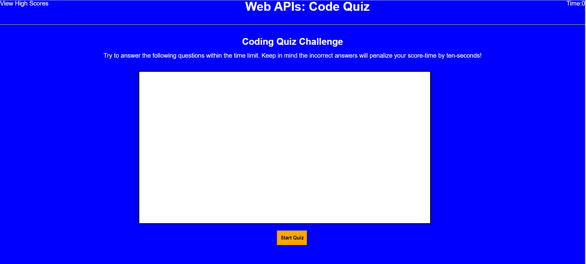

# Week 4 Homework: Web APIs: Code Quiz

## My Objective:
* Build a timed multiple choice quiz using JavaScript

* The quiz should run in the browser and feature HTML and CSS

* The quiz should track correct and incorrect answers

* TIme should be subtracted from the quiz if you choose the wrong answer

* The results should be displayed when the quiz is over

* High Scores need to be logged and displayed when you click on the View High Scores button

* A Go Back button should be deployed so the user can return to the quiz
---

---
## Here is an example of what the quiz will look like when the page is first opened:

---
## Links For Refrence:

[Webpage where the password generator can be found](https://carletta88.github.io/homework4/)

[Link to responsitory with the html, css, and javascript](https://github.com/Carletta88/homework4)
